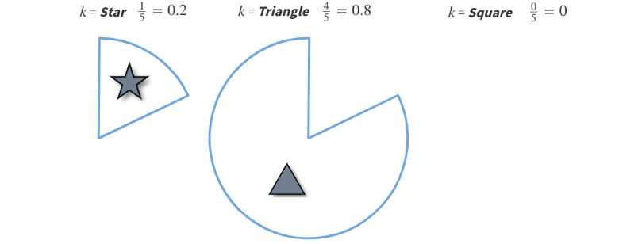
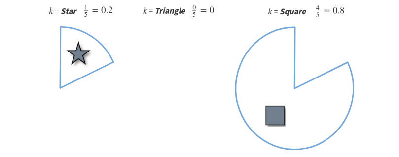
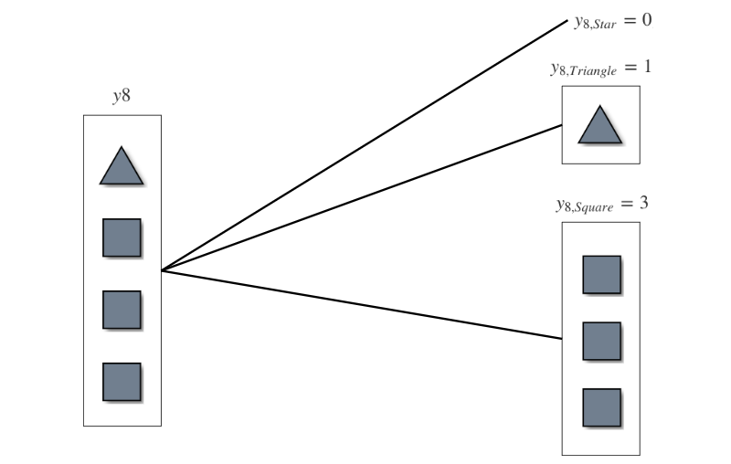

```{r include=FALSE}
library(visNetwork)
library(igraph)
library(r2d3)
library(kableExtra)
library(dplyr)
library(shiny)
library(tidyverse)
library(shinythemes)
library(DT)
library(png)
library(magick)
```

<br>

# Consistently estimating network statistics using *Aggregated Relational Data* (***ARD***): A Primer
The full paper can be found [here](https://arxiv.org/abs/1908.09881).

<br>

### How does disease spread during a pandemic?

### Or how does a meme go viral on a social media platform?

### Social scientists use ***network data*** to answer these types of questions. 

### However, collecting complete ***network data*** for this type of research is expensive, time-consuming, and often infeasible. 

### ***ARD*** offers a cheaper alternative to researchers who cannot otherwise acquire network data.

### To collect ***ARD***, a researcher asks respondents questions of the form:

<br>

<center> <font size="5">  ***How many people with trait X do you know?*** </font>  </center>

### and uses the responses to estimate unobserved features of the network.

<br>

### Suppose we want to know the ***probability*** that two people are friends given that they are each from distinct, unobserved communities.

### When observable traits are associated with unobserved communities, we can use observations from ARD responses to estimate this ***probability***. 

### The remainder of this primer will illustrate the process with a toy example.

<center> <font size="5">  ***Washington College Students and Color Preferences: Lavender or Pink?*** </font>  </center>

<br>

### First we begin by generating a network of 10 students (nodes). 

### Each node is randomly assigned to one of two communities: ***Lavender*** or ***Pink***. These colors denote each nodes color preference. 
```{r, echo=FALSE}
# images as nodes
# https://datastorm-open.github.io/visNetwork/image_icon.html

set.seed(123)

#dataset
nodes = data.frame(id = 1:10,
                  label = c(rep("Lavender", 5), rep("Pink", 5)),
                  shape = "dot",
                  size = 40, 
                  font.size = 25,
                  align = "center",
                  borderWidth = 2,
                  color.background = c(rep("lavender", 5), 
                                       rep("pink", 5)),
                  color.border = "black",
                  color.highlight.background = "gold",
                  color.highlight.border = "black",
                  shadow = TRUE
                  # title = paste0("</b>Node </p>", 1:10)
)

edges = c()

visNetwork(nodes, edges)
```

### Next, let's assign a school mascot trait $k$ to each node. ***We assume that node (student) traits (school) are associated with community (color preference), but not perfectly correlated.***  For this example, let's assume each node is either a ***UW Husky***, a ***WSU Cougar***, or a ***Gonzaga Bulldog***. In practice, these traits could be other observable characteristics such as age, education, health status, etc.

### A node that prefers ***Lavender*** is more likely to be a ***Husky***, ***Pink*** nodes are more likely to be ***Cougars***, and nodes that are indifferent are most likely to be ***Bulldogs***.

```{r, echo=FALSE}
# images as nodes
# https://datastorm-open.github.io/visNetwork/image_icon.html

uw = "https://raw.githubusercontent.com/avisokay/ard_viz/master/uw.png"
wsu = "https://raw.githubusercontent.com/avisokay/ard_viz/master/wsu.png"
gu = "https://raw.githubusercontent.com/avisokay/ard_viz/master/gu.png"

#dataset
nodes = data.frame(id = 1:10,
                  # label = as.character(1:10),
                  shape = "circularImage",
                  image = c(gu, uw, uw, uw, wsu, uw, wsu, gu, wsu, wsu),
                  size = 40,
                  font.size = 25,
                  align = "center",
                  borderWidth = 2,
                  color.background = c(rep("lavender", 5), 
                                       rep("pink", 5)),
                  color.border = "black",
                  color.highlight.background = "gold",
                  color.highlight.border = "black",
                  shadow = FALSE
                  # title = paste0("</b>Node </p>", 1:10)
)

edges = c()

visNetwork(nodes, edges)
```

### Finally, we assume there is ***community homophily*** in this network, such that the ***probability*** of node $i$ knowing node $j$ (denoted as $p_{ij}$), is ***greater*** if $i$ and $j$ are in the ***same community***. 

### In other words, nodes who prefer ***Lavender*** are more likely to connect with nodes who also prefer ***Lavender***, and same for ***Pink*** nodes. 

### Now that we have generated nodes with color preferences, assigned school mascot traits $k$, and formed edges, we will call this ***complete network $G$***. 

```{r, echo=FALSE}

edges = data.frame(from = c(1, 2, 3, 3, 4, 4, 5, 6, 6, 7, 8, 9, 8),
                  to   = c(3, 3, 4, 5, 5, 6, 7, 2, 8, 8, 9, 10, 10))

visNetwork(nodes, edges)
```

### $G$ is what a researcher would oberve ***if*** they could collect ***complete*** network data.

### In this example however, the researcher can only directly observe traits ***k***, not color preferences or edges between individual nodes. We call this ***observed network $G^{*}$***.

```{r, echo=FALSE}

#dataset
nodes$color.background = "white"

edges = c()

visNetwork(nodes, edges)
```

# 3. Gathering *Aggregated Relational Data* (***ARD***)

### Recall that ***ARD*** is collected by asking nodes in a network questions of the form *How many people with trait X do you know?* 

### In this example, the researcher would ask each node: How many ***UW Huskies*** do you know? How many ***WSU Cougars***? How many ***Gonzaga Bulldogs***?

<br> 
<center> <font size="5">  ***Click on a node to see each who it knows!*** </font>  </center>

```{r, echo=FALSE}
#dataset
nodes = data.frame(id = 1:10,
                  label = as.character(1:10),
                  shape = "circularImage",
                  image = c(gu, uw, uw, uw, wsu, uw, wsu, gu, wsu, wsu),
                  size = 40,
                  font.size = 25,
                  align = "center",
                  borderWidth = 2,
                  color.background = "white",
                  color.border = "black",
                  color.highlight.background = "gold",
                  color.highlight.border = "black",
                  shadow = FALSE
                  # title = paste0("</b>Node </p>", 1:10)
)

edges = data.frame(from = c(1, 2, 3, 3, 4, 4, 5, 6, 6, 7, 8, 9, 10),
                  to   = c(3, 3, 4, 5, 5, 6, 7, 2, 8, 8, 9, 10, 8))

# how many each node knows data
ARD = data.frame(rbind(c(1, 0, 1, 0),
                       c(2, 0, 2, 0),
                       c(3, 1, 2, 1),
                       c(4, 0, 2, 1),
                       c(5, 0, 2, 1),
                       c(6, 1, 2, 0),
                       c(7, 1, 0, 1),
                       c(8, 0, 1, 3),
                       c(9, 1, 0, 1),
                       c(10, 1, 0, 1)))
colnames(ARD) = c("Node", "Bulldog", "Husky", "Cougar")
ui = fluidPage(
    visNetworkOutput("network_proxy", height = "600px"),
    dataTableOutput("nodes_data_from_shiny", width="100%")
)
server = function(input, output, session) {
  # highlight selected node and contacts
  output$network_proxy = renderVisNetwork({
    visNetwork(nodes, edges) %>%
      visOptions(highlightNearest=TRUE) %>%
      
      visEvents(select = "function(nodes) {
                Shiny.onInputChange('current_node_id', nodes.nodes);
                ;}")
  })
  
  # display output from ARD table based on node selection
  output$nodes_data_from_shiny = renderDT({
    info = data.frame(ARD)
    
    info[ARD$Node == input$current_node_id, ]
  }, 
  
  # only display table, not search or page toggle
  options = list(dom = 't'),
  rownames = FALSE)
}
shinyApp(ui, server, options = list(height = 725))
```

### Asking each node $i$ in $G^{*}$ how many of their neighbors have a given trait $k$  produces a single ***ARD*** response $y_{ik}$.

<br>

### For example, node 4 knows no ***Bulldogs***, two ***Huskies***, and one ***Cougar***, so

<br>

<center> <font size="5">  $y_{4,Bulldog} = 0, \;\;\;\;\;\;\;\;\;\;\; y_{4,Husky} = 2, \;\;\;\;\;\;\;\;\;\;\; y_{4,Cougar} = 1$ <font> <center/>

<br>

### Node 8 also knows no ***Bulldogs***, but knows one ***Husky*** and three ***Cougars***, so

<br>

<center> <font size="5">  $y_{8,Bulldog} = 0, \;\;\;\;\;\;\;\;\;\;\; y_{8,Husky} = 1, \;\;\;\;\;\;\;\;\;\;\; y_{8,Cougar} = 3$ <font> <center/>

<br>

### and so on...

### Repeating this process and aggregating for all $y_{ik}$ yields the following ***ARD*** table which we call $Y$ below.

<br>

```{r, echo = FALSE}
ARD %>%
  kbl() %>%
  kable_styling(bootstrap_options = c("striped", "hover"), full_width = T)
```

# 4. Estimating Community Structure using ***ARD***

### Now we can use ***ARD*** responses $Y$ we gathered above to estimate $\hat{P}cc^{\prime}$, the probability of connection between a node in community $Lavender$ and node in community $Pink$.

### Please refer to the [full paper](https://arxiv.org/abs/1908.09881) for further details on how we compute estimates using the ARD data.

### First, we use k-means clustering to classify nodes into communities $\hat{c}$ and $\hat{c}^{\prime}$ based on their ***ARD*** responses $y_{ik}$. 

### In our example, since ***Triangles*** know mostly other ***Triangles***, they get clustered together while ***Stars*** don't know other ***Stars***, so they are not clustered together. 

```{r, echo = FALSE,out.width="850.px"}

knitr::include_graphics("communities.PNG")

```

### Refer to page seven of our [full paper](https://arxiv.org/abs/1908.09881) for details about our proposed clustering algorithm.

### Once we have assigned nodes to communities $\hat{c}$ and $\hat{c}^{\prime}$, we calculate the fraction of each trait in each community. 

### So in our example we have $\hat{c}$

<br>

```{r echo = FALSE,out.width="850.px"}



```

<br>

### and $\hat{c}^{\prime}$

<br>

```{r echo = FALSE,out.width="850.px"}



```

<br>

### Tabulated percentages:

<br>

```{r, echo = FALSE}

community_fraction = data.frame(C1 = c("20%", "80%", "0%"),
                                C2 = c("20%", "0%", "80%"))
names(community_fraction) <- c("$\\hat{c}$", "$\\hat{c}^{\\prime}$")
rownames(community_fraction) = c("Star", "Triangle", "Square")

community_fraction %>%
  kbl() %>%
  kable_styling(bootstrap_options = c("striped", "hover"), 
                full_width = FALSE,
                position = "center")
```

<br>

### Next we take ARD responses $y_i$ and disaggregate by each trait $k$ into $y_{ik}$. 

<br>

```{r, echo = FALSE,out.width = "600px"}



```

<br>

### Let's consider how we compute $\sum_{k} \frac{y_{ik} \; \mathbb{P}(community \; = \; \hat{c}^{\prime} \; | \; trait \; = \; k)}{n\hat{c}^{\prime}}$ for node $y_8$. 

<br>

### Recall that from $Y$, we have the following $y_{ik}'s$

<br>

<center> <font size = 5> $y_{8,Star} = 0, \;\;\;\;\;\;\;\;\;\;\; y_{8,Triangle} = 1, \;\;\;\;\;\;\;\;\;\;\; y_{8,Square} = 3$ <font> </center>

### Because there are 5 nodes each in $n\hat{c}$ and $n\hat{c}^{\prime}$ and we surveyed all nodes, 

<br>

<center> <font size = 5> $n\hat{c} = 5, \;\;\;\;\;\;\;\;\;\;\; n\hat{c}^{\prime} = 5$ <font> </center>

### From the clustering we have 

<br>

<center> <font size = 5> $\mathbb{P}(community \; = \; \hat{c}^{\prime} \; | \; trait \; = \; Star) = 0.2$ <font> </center>

<br>

<center> <font size = 5> $\mathbb{P}(community \; = \; \hat{c}^{\prime} \; | \; trait \; = \; Triangle) = 0$ <font> </center>

<br>

<center> <font size = 5> $\mathbb{P}(community \; = \; \hat{c}^{\prime} \; | \; trait \; = \; Square)  \;\;= 0.8$<font> </center>

<br>

### For $i$ = 8 and $k$ = ***Star***,

<br>

<center> <font size = 5> $\frac{y_{8, Star} \; * \; \mathbb{P}(community \; = \; \hat{c}^{\prime} \; | \; trait \; = \; Star)}{n\hat{c}^{\prime}} = \frac{0 \; * \; 0.2}{5} = 0$ <font> </center>

### For $i$ = 8 and $k$ = ***Triangle***,

<br>

<center> <font size = 5> $\frac{y_{8, Triangle} \; * \; \mathbb{P}(community \; = \; \hat{c}^{\prime} \; | \; trait \; = \; Triangle)}{n\hat{c}^{\prime}} = \frac{1 \; * \; 0}{5} = 0$ <font> </center>

<br>

### And for $i$ = 8 and $k$ = ***Square***, 

<br>

```{r, echo = FALSE,out.width = "800px"}

knitr::include_graphics("scaling2.png")

```

<br>

### dividing by $n\hat{c}^{\prime} = 5$ gives

<br>

<center> <font size = 5> $\frac{y_{8, Square} \; * \; \mathbb{P}(community \; = \; \hat{c}^{\prime} \; | \; trait \; = \; Square)}{n\hat{c}^{\prime}} = \frac{3 \; * \; 0.8}{5} = 0.48$ <center/>

<br>

### Then we take the sum of each computed $\frac{y_{ik} \; \mathbb{P}(community \; = \; \hat{c}^{\prime} \; | \; trait \; = \; k)}{n\hat{c}^{\prime}}$ for each trait $k$. 

<br>

### So for $y_8$, $\sum_{k} \frac{y_{8k} \; \mathbb{P}(community \; = \; \hat{c}^{\prime} \; | \; trait \; = \; k)}{n\hat{c}^{\prime}} = 0 + 0 + 0.48 = 0.48$

<br>

### Finally, to calculate $\hat{P}cc^{\prime}$, we do the above calculation for each node $i \in \hat{c}$ and sum over the sample size of $\hat{c}$, n$\hat{c}$. 

<br>

```{r echo=FALSE}
Y = data.frame(rbind(c(0, 1, 0),
                       c(0, 2, 0),
                       c(1, 2, 1),
                       c(0, 2, 1),
                       c(0, 2, 1),
                       c(1, 2, 0),
                       c(1, 0, 1),
                       c(0, 1, 3),
                       c(1, 0, 1),
                       c(1, 0, 1)))
colnames(Y) = c("Star", "Triangle", "Square")
Y = as.matrix(Y)

hat_c_prime = c(0.2, 0, 0.8)

result = Y%*%hat_c_prime
result_scaled = result/5

results = data.frame(Node = c(2,3,4,6,8),
                     Probability = c(result_scaled[2],
                                     result_scaled[3],
                                     result_scaled[4],
                                     result_scaled[6],
                                     result_scaled[8])
                     )

names(results) = c("$i \\in \\hat{c}$", "$Probability$")

results %>%
  kbl() %>%
  kable_styling(bootstrap_options = c("striped", "hover"), 
                full_width = FALSE,
                position = "center")
```

<br>

### In our toy example, we estimate $\hat{P}cc^{\prime} = \frac{1}{5} \; (0 + 0.20 + 0.16 + 0.04 + 0.48) = 0.176$

```{r echo=FALSE}
### Fraction of $\hat{c}$ for each trait $k$

### $k$ =  ***Star***

### $k$ = ***Triangle***

### $k$ = ***Square***
```

<br> 

<br>

<br>

<br>

<br>

<br>

<br>


