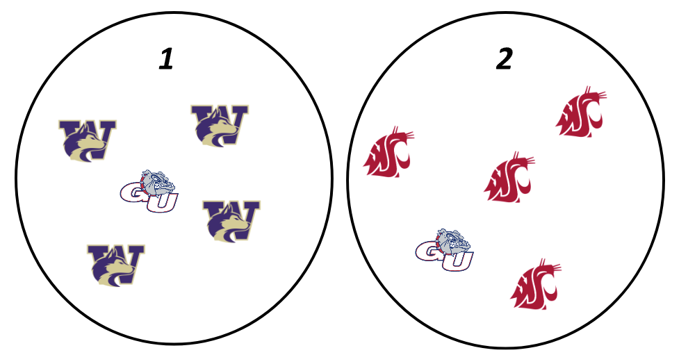
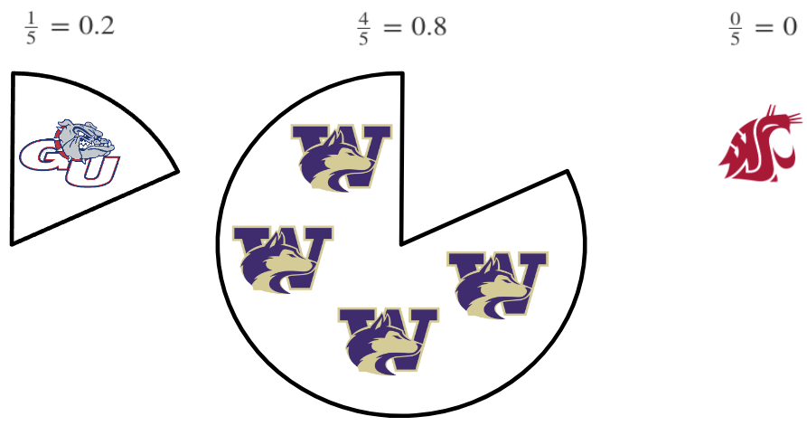
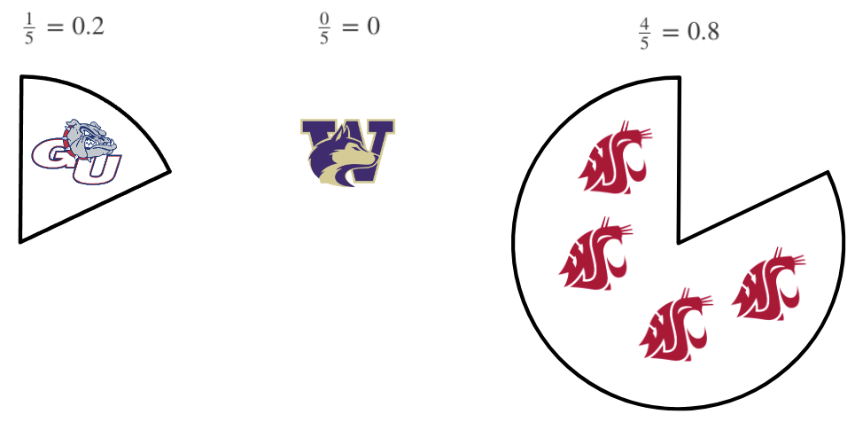

```{r include=FALSE}
library(visNetwork)
library(igraph)
library(r2d3)
library(kableExtra)
library(dplyr)
library(shiny)
library(tidyverse)
library(shinythemes)
library(DT)
library(png)
library(magick)
library(rsconnect)
```

<br>

# Consistently estimating network statistics using *Aggregated Relational Data* (***ARD***)
#### Guide by Adam Visokay
#### Paper by Emily Breza, Arun Chandrasekhar, Shane Lubold, Tyler H. McCormick, Mengjie Pan

#### The full paper can be found [here](https://www.pnas.org/doi/full/10.1073/pnas.2207185120).

<br>

### How does disease spread during a pandemic?

### Or how does a meme go viral on a social media platform?

### Social scientists use ***network data*** to answer these types of questions. 

### However, collecting complete ***network data*** for this type of research is expensive, time-consuming, and often infeasible. 

### ***ARD*** offers a cheaper alternative to researchers who cannot otherwise acquire network data.

### To collect ***ARD***, a researcher asks questions of the form:

<br>

<center> <font size="5">  ***How many people with trait X do you know?*** </font>  </center>

### and uses the responses to estimate unobserved features of the network.

<br>

### Suppose we want to know the ***probability*** that two people are friends given that they are each from distinct, unobserved communities.

### When observable traits are associated with unobserved communities, we can use observations from ARD responses to estimate this ***probability***. 

### The remainder of this primer will illustrate the process with a toy example.

<br>

<center> <font size="5">  ***Washington College Students and Color Preferences: Lavender or Pink?*** </font>  </center>

<br>

### In this simplified example, we have students of three different schools and two different colors. Our goal is to estimate the probability that a given student prefers ***Lavender*** or ***Pink***. The best way to answer this question would be to simply survey each student and ask them their color preference. But in this example, we assume that we cannot ask directly about color preferences. But we can collect data about the network, and combine that with the assumption that color preferences are associated with where students choose to study. 

<br>

### First we begin by generating a network of 10 students (nodes). 

### Each node is randomly assigned to one of two communities: ***Lavender*** or ***Pink***.

<center>
```{r, echo=FALSE}
# images as nodes
# https://datastorm-open.github.io/visNetwork/image_icon.html

set.seed(123)

#dataset
nodes = data.frame(id = 1:10,
                  label = c(rep("Lavender", 5), rep("Pink", 5)),
                  shape = "dot",
                  size = 40, 
                  font.size = 25,
                  align = "center",
                  borderWidth = 2,
                  color.background = c(rep("lavender", 5), 
                                       rep("pink", 5)),
                  color.border = "black",
                  color.highlight.background = "gold",
                  color.highlight.border = "black",
                  shadow = TRUE
                  # title = paste0("</b>Node </p>", 1:10)
)

edges = c()

visNetwork(nodes, edges)
```
</center>

### Next, let's assign a school mascot trait $k$ to each node. ***We assume that node (student) traits (school) are associated with community (color preference), but not perfectly correlated.***  

### For this example, let's assume each node is either a ***UW Husky***, a ***WSU Cougar***, or a ***Gonzaga Bulldog***. In practice, these traits could be other observable characteristics such as age, education, health status, etc.

### A node that prefers ***Lavender*** is more likely to be a ***Husky***, ***Pink*** nodes are more likely to be ***Cougars***, and nodes that are indifferent are most likely to be ***Bulldogs***.

<center>
```{r, echo=FALSE}
# images as nodes
# https://datastorm-open.github.io/visNetwork/image_icon.html

uw = "https://raw.githubusercontent.com/avisokay/ard_viz/master/uw.png"
wsu = "https://raw.githubusercontent.com/avisokay/ard_viz/master/wsu.png"
gu = "https://raw.githubusercontent.com/avisokay/ard_viz/master/gu.png"

#dataset
nodes = data.frame(id = 1:10,
                  # label = as.character(1:10),
                  shape = "circularImage",
                  image = c(gu, uw, uw, uw, wsu, uw, wsu, gu, wsu, wsu),
                  size = 40,
                  font.size = 25,
                  align = "center",
                  borderWidth = 2,
                  color.background = c(rep("lavender", 5), 
                                       rep("pink", 5)),
                  color.border = "black",
                  color.highlight.background = "gold",
                  color.highlight.border = "black",
                  shadow = FALSE
                  # title = paste0("</b>Node </p>", 1:10)
)

edges = c()

visNetwork(nodes, edges)
```
</center>

### Finally, we assume there is ***community homophily*** in this network, such that the ***probability*** of node $i$ knowing node $j$ (denoted as $p_{ij}$), is ***greater*** if $i$ and $j$ are in the ***same community***. 

### In other words, nodes who prefer ***Lavender*** are more likely to connect with nodes who also prefer ***Lavender***, and same for ***Pink*** nodes. 

### Now that we have generated nodes with color preferences, assigned school mascot traits $k$, and formed edges, we will call this ***complete network $G$***. 

<center>
```{r, echo=FALSE}

edges = data.frame(from = c(1, 2, 3, 3, 4, 4, 5, 6, 6, 7, 8, 9, 8),
                  to   = c(3, 3, 4, 5, 5, 6, 7, 2, 8, 8, 9, 10, 10))

visNetwork(nodes, edges)
```
</center>

### $G$ is what a researcher would oberve ***if*** they could collect ***complete*** network data.

### In this example however, the researcher can only directly observe trait ***k*** (school), not color preferences or edges between individual nodes. We call this ***observed network $G^{*}$***.

<center>
```{r, echo=FALSE}

#dataset
nodes$color.background = "white"

edges = c()

visNetwork(nodes, edges)
```
</center>

# 3. Gathering *Aggregated Relational Data* (***ARD***)

### Recall that ***ARD*** is collected by asking nodes in a network questions of the form *How many people with trait X do you know?* 

### In this example, the researcher would ask each node: How many ***UW Huskies*** do you know? How many ***WSU Cougars***? How many ***Gonzaga Bulldogs***?

<br> 
<center> <font size="5">  ***Click on a node to see each who it knows!*** </font>  </center>

<center>
```{r, echo=FALSE}
#dataset
nodes = data.frame(id = 1:10,
                  label = as.character(1:10),
                  shape = "circularImage",
                  image = c(gu, uw, uw, uw, wsu, uw, wsu, gu, wsu, wsu),
                  size = 40,
                  font.size = 25,
                  align = "center",
                  borderWidth = 2,
                  color.background = "white",
                  color.border = "black",
                  color.highlight.background = "gold",
                  color.highlight.border = "black",
                  shadow = FALSE
                  # title = paste0("</b>Node </p>", 1:10)
)

edges = data.frame(from = c(1, 2, 3, 3, 4, 4, 5, 6, 6, 7, 8, 9, 10),
                  to   = c(3, 3, 4, 5, 5, 6, 7, 2, 8, 8, 9, 10, 8))

# how many each node knows data
ARD = data.frame(rbind(c(1, 0, 1, 0),
                       c(2, 0, 2, 0),
                       c(3, 1, 2, 1),
                       c(4, 0, 2, 1),
                       c(5, 0, 2, 1),
                       c(6, 1, 2, 0),
                       c(7, 1, 0, 1),
                       c(8, 0, 1, 3),
                       c(9, 1, 0, 1),
                       c(10, 1, 0, 1)))
colnames(ARD) = c("Node", "Bulldog", "Husky", "Cougar")
ui = fluidPage(
    visNetworkOutput("network_proxy", height = "600px"),
    dataTableOutput("nodes_data_from_shiny", width="100%")
)
server = function(input, output, session) {
  # highlight selected node and contacts
  output$network_proxy = renderVisNetwork({
    visNetwork(nodes, edges) %>%
      visOptions(highlightNearest=TRUE) %>%
      
      visEvents(select = "function(nodes) {
                Shiny.onInputChange('current_node_id', nodes.nodes);
                ;}")
  })
  
  # display output from ARD table based on node selection
  output$nodes_data_from_shiny = renderDT({
    info = data.frame(ARD)
    
    info[ARD$Node == input$current_node_id, ]
  }, 
  
  # only display table, not search or page toggle
  options = list(dom = 't'),
  rownames = FALSE)
}
shinyApp(ui, server, options = list(height = 725))
```
</center>

### Asking each node $i$ in $G^{*}$ how many of their neighbors have a given trait $k$  produces a single ***ARD*** response $y_{ik}$.

<br>

### For example, node 4 knows no ***Bulldogs***, two ***Huskies***, and one ***Cougar***, so

<br>

<center> <font size="5">  $y_{4,Bulldog} = 0, \;\;\;\;\;\;\;\;\;\;\; y_{4,Husky} = 2, \;\;\;\;\;\;\;\;\;\;\; y_{4,Cougar} = 1$ <font> <center/>

<br>

### Node 8 also knows no ***Bulldogs***, but knows one ***Husky*** and three ***Cougars***, so

<br>

<center> <font size="5">  $y_{8,Bulldog} = 0, \;\;\;\;\;\;\;\;\;\;\; y_{8,Husky} = 1, \;\;\;\;\;\;\;\;\;\;\; y_{8,Cougar} = 3$ <font> <center/>

<br>

### and so on...

### Repeating this process and aggregating for all $y_{ik}$ yields the following ***ARD*** table which we call $Y$ below.

<br>

<center>
```{r, echo = FALSE}
ARD %>%
  kbl() %>%
  kable_styling(bootstrap_options = c("striped", "hover"), full_width = T)
```
</center>

# 4. Estimating Community Structure using ***ARD***

### Now we can use ***ARD*** responses $Y$ we gathered above to estimate the probability that a given node is a member of unobserved latent communities <b><i>1</i></b> or <b><i>2</i></b>.

### Please refer to the [full paper](https://arxiv.org/abs/1908.09881) for further details on how we compute estimates using the ARD data.

### First, we use k-means clustering to classify nodes into unobserved latent communities <b><i>1</i></b> and <b><i>2</i></b> based on their ***ARD*** responses $y_{ik}$. 

### In our example, since ***Huskies*** know mostly other ***Huskies***, they get clustered together while ***Bulldogs*** don't know other ***Bulldogs***, so they are not clustered together. 

<center>
```{r, echo = FALSE,out.width="850.px"}



```
</center>

### Refer to page seven of our [full paper](https://arxiv.org/abs/1908.09881) for details about our proposed clustering algorithm.

### Once we have assigned nodes to communities <b><i>1</i></b> and <b><i>2</i></b>, we calculate the fraction of each trait in each community. 

### So in our example we have community <b><i>1</i></b> as

<br>

<center>
```{r echo = FALSE,out.width="850.px"}



```
</center>

<br>

### and community <b><i>2</i></b> as

<br>

<center>
```{r echo = FALSE,out.width="850.px"}



```
</center>

<br>

### Next we take ARD responses $y_i$ and disaggregate by each trait $k$ into $y_{ik}$. 

<br>

<center>
```{r, echo = FALSE,out.width = "600px"}

knitr::include_graphics("disaggregate_uw.PNG")

```
</center>

<br>
 
### We now have all the pieces needed to compute our estimate. 

### Because we know how many people someone knows in each latent community, we can estimate the probability of cross-type links.  

### We divide by the size of the latent community used to calculate each estimate and take the sum. In our case the size of each latent community is 5 which gives the following for node 8:

<br>

<center> <font size="5">  $\frac{0}{5} + \space \frac{0}{5} + \space \frac{2.4}{5} \space = 0.48$ </font>  </center>

<br>

### Finally, to compute the final entity, we repeat the above computation for all nodes 1-10 and take the average:

<center> <font size="5">  $P_{cc^{\prime}} = \frac{1}{n}\sum_{i=1}^{n} (y_{ik} \space * \space Pr(community \space | \space trait))$ </font>  </center>

<br>
<br>
<br>
<br>
<br>
<br>