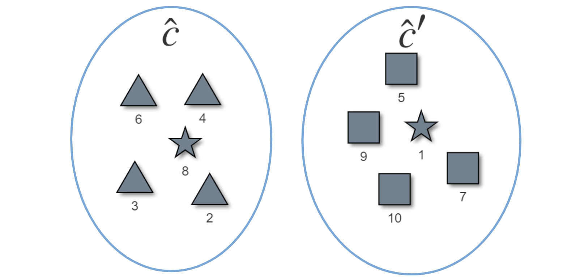
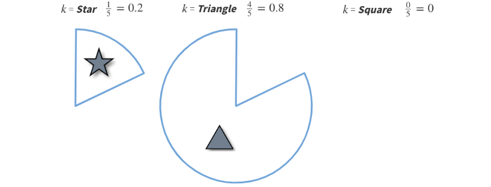
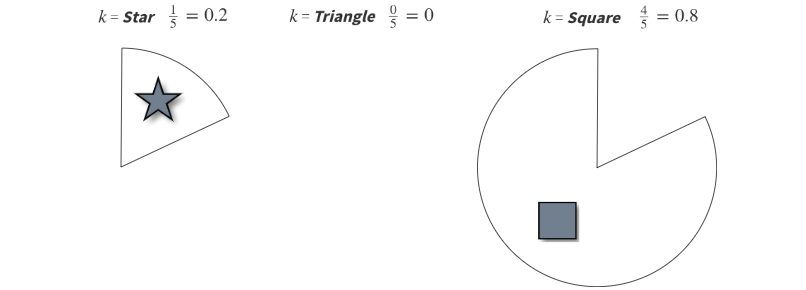
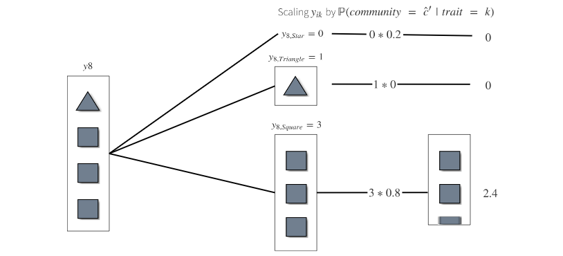

```{r include=FALSE}
library(visNetwork)
library(igraph)
library(r2d3)
library(kableExtra)
library(dplyr)
library(shiny)
library(tidyverse)
library(shinythemes)
library(DT)
```

<br>

# Consistently estimating network statistics using *Aggregated Relational Data* (***ARD***): A Primer
The full paper can be found [here](https://arxiv.org/abs/1908.09881).

<br>

### How does disease spread during a pandemic?

### Or how does a meme go viral on a social media platform?

### Social scientists use ***network data*** to answer these types of questions. 

### However, collecting complete ***network data*** for this type of research is expensive, time-consuming, and often infeasible. 

### ***ARD*** offers a cheaper alternative to researchers who cannot otherwise acquire network data.

### To collect ***ARD***, a researcher asks respondents questions of the form:

<br>

<center> <font size="5">  ***How many people with trait X do you know?*** </font>  </center>

### and uses the responses to estimate latent features of the network.

<br>

# 1. What are we trying to estimate?

### Suppose we want to know the ***probability*** that two nodes connect given that they are each from distinct latent communities $c$ and $c^{\prime}$. We label this probability as $Pcc^{\prime}$. *EXAMPLE HERE* For example, the probability that ......

### When observable traits are associated with latent communities, researchers can use observations from ARD responses to estimate this probability. 

### The remainder of this primer will illustrate the process with a toy example.

# 2. Generating an example network.

### Let's begin by generating a network of 10 nodes. 

### Each node is randomly assigned to one of two communities, $c$ (***Red***) or $c^{\prime}$ (***Gold***).

```{r, echo=FALSE}

#dataset
nodes = data.frame(id = 1:10,
                  label = as.character(1:10),
                  shape = "dot",
                  size = 30, 
                  font.size = 25,
                  align = "center",
                  group = c(rep("tomato", 5), 
                            rep("Gold", 5)),
                  borderWidth = 2,
                  color.background = c(rep("tomato", 5), 
                                       rep("Gold", 5)),
                  color.border = "black",
                  color.highlight.background = c(rep("tomato", 5), 
                                                 rep("gold", 5)),
                  color.highlight.border = "black",
                  shadow = TRUE
                  # title = paste0("</b>Node </p>", 1:10)
)

edges = c()

visNetwork(nodes, edges)
```

### Next, let's assign a shape trait $k$ to each node; either a ***Triangle***, ***Square***, or a ***Star***. In practice, these traits would be age, education, health status, etc.

### ***We assume that traits are associated with community, but not perfectly correlated.***  
<center> <font size="5">  (remember this for later) <font> <center/>

### For this example, a node is more likely to be a ***Square*** if it is in the ***Gold*** community, more likely to be a ***Triangle*** if it is in the ***Red*** community, and equally likely to be a ***Star*** regardless of community.  

```{r, echo=FALSE}

#dataset
nodes = data.frame(id = 1:10,
                  label = as.character(1:10),
                  shape = c("star", 
                            "triangle",
                            "triangle", 
                            "triangle",
                            "square", 
                            "triangle",
                            "square", 
                            "star",
                            "square", 
                            "square"),
                  size = 30, 
                  font.size = 25,
                  align = "center",
                  group = c(rep("tomato", 5), 
                            rep("Gold", 5)),
                  borderWidth = 2,
                  color.background = c(rep("tomato", 5), 
                                       rep("Gold", 5)),
                  color.border = "black",
                  color.highlight.background = c(rep("tomato", 5), 
                                                 rep("gold", 5)),
                  color.highlight.border = "black",
                  shadow = TRUE
                  # title = paste0("</b>Node </p>", 1:10)
)

edges = c()

visNetwork(nodes, edges)
```

### Finally, we assume there is ***community homophily*** in this network such that the ***probability*** of node $i$ forming an edge with node $j$, $p_{ij}$, is ***greater*** if $i$ and $j$ are in the ***same community***.

### In other words, ***Red*** nodes are more likely to connect with other ***Red***  nodes, and same for ***Gold*** nodes. 

### Now that we have generated nodes and assigned communities, traits and edges, we will call this complete network $G$. 

```{r, echo=FALSE}

#dataset
nodes = data.frame(id = 1:10,
                  label = as.character(1:10),
                  shape = c("star", 
                            "triangle",
                            "triangle", 
                            "triangle",
                            "square", 
                            "triangle",
                            "square", 
                            "star",
                            "square", 
                            "square"),
                  size = 30, 
                  font.size = 25,
                  align = "center",
                  group = c(rep("tomato", 5), 
                            rep("Gold", 5)),
                  borderWidth = 2,
                  color.background = c(rep("tomato", 5), 
                                       rep("Gold", 5)),
                  color.border = "black",
                  color.highlight.background = c(rep("tomato", 5), 
                                                 rep("gold", 5)),
                  color.highlight.border = "black",
                  shadow = TRUE
                  # title = paste0("</b>Node </p>", 1:10)
)

edges = data.frame(from = c(1, 2, 3, 3, 4, 4, 5, 6, 6, 7, 8, 9, 8),
                  to   = c(3, 3, 4, 5, 5, 6, 7, 2, 8, 8, 9, 10, 10))

visNetwork(nodes, edges)
```

### $G$ is what a researcher would oberve ***if*** they could collect complete network data.

### In this example however, the researcher can only directly observe traits ***k***, not communities or edges between individual nodes. We call this ***observed network $G^{*}$***.

```{r, echo=FALSE}

#dataset
nodes = data.frame(id = 1:10,
                  label = as.character(1:10),
                  shape = c("star", 
                            "triangle",
                            "triangle", 
                            "triangle",
                            "square", 
                            "triangle",
                            "square", 
                            "star",
                            "square", 
                            "square"),
                  size = 30, 
                  font.size = 25,
                  align = "center",
                  group = c(rep("tomato", 5), 
                            rep("Gold", 5)),
                  borderWidth = 2,
                  color.background = "slategrey",
                  color.border = "black",
                  color.highlight.background = "slategrey",
                  color.highlight.border = "black",
                  shadow = TRUE
                  # title = paste0("</b>Node </p>", 1:10)
)

edges = c()

visNetwork(nodes, edges)
```

# 3. Gathering *Aggregated Relational Data* (***ARD***)

### Recall that ***ARD*** is collected by asking nodes in a network questions of the form *How many people with trait X do you know?* 

### In this example, the researcher would ask each node: How many ***Triangles*** do you know? How many ***Squares***? How many ***Stars***?

<br> 
<center> <font size="5">  ***Click on a node to see each shape it knows!*** </font>  </center>

```{r, echo=FALSE}
#dataset
node = data.frame(id = 1:10,
                  label = as.character(1:10),
                  shape = c("star", 
                            "triangle",
                            "triangle", 
                            "triangle",
                            "square", 
                            "triangle",
                            "square", 
                            "star",
                            "square", 
                            "square"),
                  size = c(35,
                           30,
                           30,
                           30,
                           30,
                           30,
                           30,
                           35,
                           30,
                           30), 
                  font.size = 25,
                  align = "center",
                  # group = c(rep("tomato", 5), 
                  #           rep("Gold", 5)),
                  borderWidth = 2,
                  color.background = "slategrey",
                  color.border = "black",
                  color.highlight.background = "slategrey",
                  color.highlight.border = "black",
                  shadow = TRUE
                  # title = paste0("</b>Node </p>", 1:10)
)
edge = data.frame(from = c(1, 2, 3, 3, 4, 4, 5, 6, 6, 7, 8, 9, 10),
                  to   = c(3, 3, 4, 5, 5, 6, 7, 2, 8, 8, 9, 10, 8),
                  color = "white")

# how many each node knows data
ARD = data.frame(rbind(c(1, 0, 1, 0),
                       c(2, 0, 2, 0),
                       c(3, 1, 2, 1),
                       c(4, 0, 2, 1),
                       c(5, 0, 2, 1),
                       c(6, 1, 2, 0),
                       c(7, 1, 0, 1),
                       c(8, 0, 1, 3),
                       c(9, 1, 0, 1),
                       c(10, 1, 0, 1)))
colnames(ARD) = c("Node", "Star", "Triangle", "Square")
ui = fluidPage(
    visNetworkOutput("network_proxy", height = "600px"),
    dataTableOutput("nodes_data_from_shiny", width="100%")
)
server = function(input, output, session) {
  # highlight selected node and contacts
  output$network_proxy = renderVisNetwork({
    visNetwork(node, edge) %>%
      visOptions(highlightNearest=TRUE) %>%
      
      visEvents(select = "function(nodes) {
                Shiny.onInputChange('current_node_id', nodes.nodes);
                ;}")
  })
  
  # display output from ARD table based on node selection
  output$nodes_data_from_shiny = renderDT({
    info = data.frame(ARD)
    
    info[ARD$Node == input$current_node_id, ]
  }, 
  
  # only display table, not search or page toggle
  options = list(dom = 't'),
  rownames = FALSE)
}
shinyApp(ui, server, options = list(height = 725))
```

### Asking each node $i$ in $G^{*}$ how many of their neighbors have a given trait ***k***  produces a single ***ARD*** response $y_{ik}$.

<br>

### For example, node 4 knows no ***Stars***, two ***Triangles***, and one ***Square***, so

<br>

<center> <font size="5">  $y_{4,Star} = 0, \;\;\;\;\;\;\;\;\;\;\; y_{4,Triangle} = 2, \;\;\;\;\;\;\;\;\;\;\; y_{4,Square} = 1$ <font> <center/>

<br>

### Node 8 also knows no ***Stars***, but knows one ***Triangle*** and three ***Squares***, so

<br>

<center> <font size="5">  $y_{8,Star} = 0, \;\;\;\;\;\;\;\;\;\;\; y_{8,Triangle} = 1, \;\;\;\;\;\;\;\;\;\;\; y_{8,Square} = 3$ <font> <center/>

<br>

### and so on...

### Repeating this process and aggregating for all $y_{ik}$ yields the following ***ARD*** we call $Y$ below.

<br>

```{r, echo = FALSE}
ARD %>%
  kbl() %>%
  kable_styling(bootstrap_options = c("striped", "hover"), full_width = T)
```

# 4. Estimating Community Structure using ***ARD***

### Now we can use ***ARD*** responses $Y$ we gathered above to estimate $\hat{P}cc^{\prime}$, the probability of connection between a node in community $c$ and node in community $c^{\prime}$.

### Below is a simplified version of the equation for $\hat{P}cc^{\prime}$, from page seven of the [full paper](https://arxiv.org/abs/1908.09881). 

<br>

<center> <font size = 6> $\hat{P}cc^{\prime} = \frac{1}{n\hat{c}} \sum_{i \in \hat{C}} \sum_{k} \frac{y_{ik} \; \mathbb{P}(community \; = \; \hat{c}^{\prime} \; | \; trait \; = \; k)}{n\hat{c}^{\prime}} \;\;\;\;\;\;\;\;\; (eq. \;1)$ <center/>

### where 
### $\hat{P}cc^{\prime}$ is the estimated connection probability between a node in $c$ and a node in $c^{\prime}$,
### $n\hat{c}$ is the sample size of surveyed nodes in estimated community $\hat{c}$,
### $y_{ik}$ is the ARD response from node $i$ with trait $k$,
### $\mathbb{P}(community \; = \; \hat{c}^{\prime} \; | \; trait \; = \; k)$ is the probability of trait $k$ in community $\hat{c}^{\prime}$,
### $n\hat{c}^{\prime}$ is the total size of estimated community $\hat{c}^{\prime}$

<br>

### Now we can compute $\hat{P}cc^{\prime}$ using our example ARD data $Y$.

### First, we cluster nodes into communities $\hat{c}$ and $\hat{c}^{\prime}$ based on their ***ARD*** response $y_i$.

```{r, echo = FALSE}



```

### There are many methods researchers could use for this clustering, but for this example we simply put ***Triangles*** together into $\hat{c}$, ***Squares*** together into $\hat{c}^{\prime}$, and one ***Star*** in each at random since there are only two. 

### Then we calculate the fraction of each trait in each community. 

### So in our example we have $\hat{c}$

<br>

```{r echo = FALSE}



```

<br>

### and $\hat{c}^{\prime}$

<br>

```{r echo = FALSE}



```

<br>

### Tabulated percentages:

<br>

```{r, echo = FALSE}

community_fraction = data.frame(C1 = c("20%", "80%", "0%"),
                                C2 = c("20%", "0%", "80%"))
names(community_fraction) <- c("$\\hat{c}$", "$\\hat{c}^{\\prime}$")
rownames(community_fraction) = c("Star", "Triangle", "Square")

community_fraction %>%
  kbl() %>%
  kable_styling(bootstrap_options = c("striped", "hover"), 
                full_width = FALSE,
                position = "center")
```

<br>

### Next we take ARD responses $y_i$ and disaggregate by each trait $k$ into $y_{ik}$. 

<br>

```{r, echo = FALSE}

knitr::include_graphics("disaggregate.PNG")

```

<br>

### Let's consider how we compute $\sum_{k} \frac{y_{ik} \; \mathbb{P}(community \; = \; \hat{c}^{\prime} \; | \; trait \; = \; k)}{n\hat{c}^{\prime}}$ for node $y_8$. 

<br>

### Recall that from $Y$, we have the following $y_{ik}'s$

<br>

<center> <font size = 5> $y_{8,Star} = 0, \;\;\;\;\;\;\;\;\;\;\; y_{8,Triangle} = 1, \;\;\;\;\;\;\;\;\;\;\; y_{8,Square} = 3$ <font> </center>

### Because there are 5 nodes each in $n\hat{c}$ and $n\hat{c}^{\prime}$ and we surveyed all nodes, 

<br>

<center> <font size = 5> $n\hat{c} = 5, \;\;\;\;\;\;\;\;\;\;\; n\hat{c}^{\prime} = 5$ <font> </center>

### From the clustering we have 

<br>

<center> <font size = 5> $\mathbb{P}(community \; = \; \hat{c}^{\prime} \; | \; trait \; = \; Star) = 0.2$ <font> </center>

<br>

<center> <font size = 5> $\mathbb{P}(community \; = \; \hat{c}^{\prime} \; | \; trait \; = \; Triangle) = 0$ <font> </center>

<br>

<center> <font size = 5> $\mathbb{P}(community \; = \; \hat{c}^{\prime} \; | \; trait \; = \; Square)  \;\;= 0.8$<font> </center>

<br>

### For $i$ = 8 and $k$ = ***Star***,

<br>

<center> <font size = 5> $\frac{y_{8, Star} \; * \; \mathbb{P}(community \; = \; \hat{c}^{\prime} \; | \; trait \; = \; Star)}{n\hat{c}^{\prime}} = \frac{0 \; * \; 0.2}{5} = 0$ <font> </center>

### For $i$ = 8 and $k$ = ***Triangle***,

<br>

<center> <font size = 5> $\frac{y_{8, Triangle} \; * \; \mathbb{P}(community \; = \; \hat{c}^{\prime} \; | \; trait \; = \; Triangle)}{n\hat{c}^{\prime}} = \frac{1 \; * \; 0}{5} = 0$ <font> </center>

<br>

### And for $i$ = 8 and $k$ = ***Square***, 

<br>

```{r, echo = FALSE}



```

<br>

### dividing by $n\hat{c}^{\prime} = 5$ gives

<br>

<center> <font size = 5> $\frac{y_{8, Square} \; * \; \mathbb{P}(community \; = \; \hat{c}^{\prime} \; | \; trait \; = \; Square)}{n\hat{c}^{\prime}} = \frac{3 \; * \; 0.8}{5} = 0.48$ <center/>

<br>

### Then we take the sum of each computed $\frac{y_{ik} \; \mathbb{P}(community \; = \; \hat{c}^{\prime} \; | \; trait \; = \; k)}{n\hat{c}^{\prime}}$ for each trait $k$. 

### So for $y_8$, $\sum_{k} \frac{y_{8k} \; \mathbb{P}(community \; = \; \hat{c}^{\prime} \; | \; trait \; = \; k)}{n\hat{c}^{\prime}} = 0 + 0 + 0.48 = 0.48$

### Finally, to calculate $\hat{P}cc^{\prime}$, we do the above calculation for each node $i \in \hat{c}$ and sum over the sample size of $\hat{c}$, n$\hat{c}$. 

<br>

```{r echo=FALSE}
Y = data.frame(rbind(c(0, 1, 0),
                       c(0, 2, 0),
                       c(1, 2, 1),
                       c(0, 2, 1),
                       c(0, 2, 1),
                       c(1, 2, 0),
                       c(1, 0, 1),
                       c(0, 1, 3),
                       c(1, 0, 1),
                       c(1, 0, 1)))
colnames(Y) = c("Star", "Triangle", "Square")
Y = as.matrix(Y)

hat_c_prime = c(0.2, 0, 0.8)

result = Y%*%hat_c_prime
result_scaled = result/5

results = data.frame(Node = c(2,3,4,6,8),
                     Probability = c(result_scaled[2],
                                     result_scaled[3],
                                     result_scaled[4],
                                     result_scaled[6],
                                     result_scaled[8])
                     )

names(results) = c("$i \\in \\hat{c}$", "$Probability$")

results %>%
  kbl() %>%
  kable_styling(bootstrap_options = c("striped", "hover"), 
                full_width = FALSE,
                position = "center")
```

<br>

### In our toy example, we estimate $\hat{P}cc^{\prime} = \frac{1}{5} \; (0 + 0.20 + 0.16 + 0.04 + 0.48) = 0.176$

### Fraction of $\hat{c}$ for each trait $k$:

### $k$ =  ***Star***

### $k$ = ***Triangle***

### $k$ = ***Square***

<br> 

<br>

<br>

<br>

<br>

<br>

<br>


