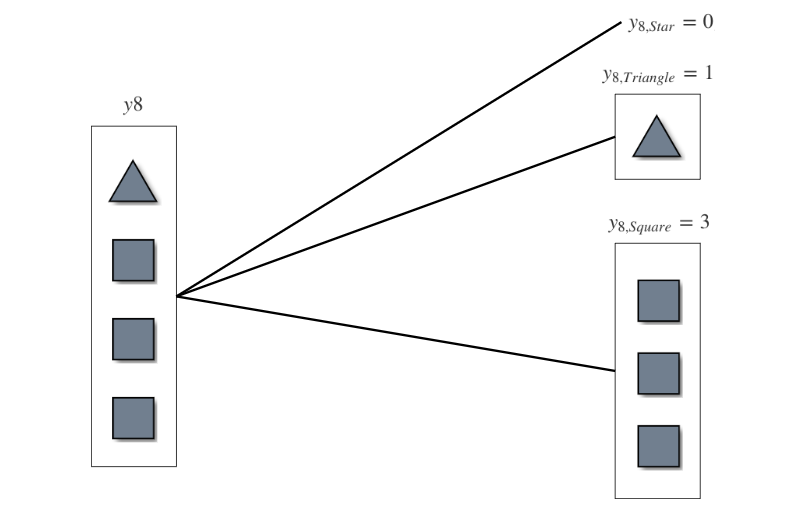
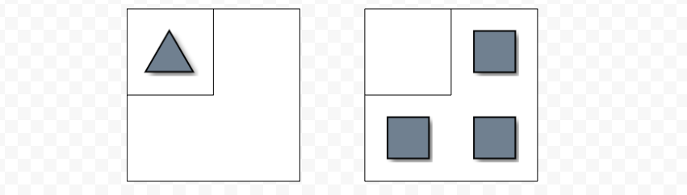

```{r include=FALSE}
library(visNetwork)
library(igraph)
library(ggdag)
library(dagitty)
library(ggthemes)
library(r2d3)
library(kableExtra)
library(dplyr)
library(shiny)
library(tidyverse)
library(shinythemes)
library(DT)
```

<br>

# Consistently estimating network statistics using *Aggregated Relational Data* (***ARD***): A Primer
The full paper can be found [here](https://arxiv.org/abs/1908.09881).

<br>

### How does disease spread during a pandemic?

### Or how does a meme go viral on a social media platform?

### Social scientists use ***network data*** to answer these types of questions. 

### However, collecting complete ***network data*** for this type of research is expensive, time-consuming, and often infeasible. 

### ***ARD*** captures network information by asking a respondent questions of the form:

<br>

<center> <font size="5">  ***How many people with trait X do you know?*** </font>  </center>

<br>

### When observable traits are associated with latent communities, researchers can use ARD responses to estimate latent community structure.  

<br>
 
### To illustrate how it works, let's generate a network of 10 nodes. 

### Each node is randomly assigned to one of two communities, ***Red*** or ***Gold***.

```{r, echo=FALSE}

#dataset
nodes = data.frame(id = 1:10,
                  label = as.character(1:10),
                  shape = "dot",
                  size = 30, 
                  font.size = 25,
                  align = "center",
                  group = c(rep("Red", 5), 
                            rep("Gold", 5)),
                  borderWidth = 2,
                  color.background = c(rep("Red", 5), 
                                       rep("Gold", 5)),
                  color.border = "black",
                  color.highlight.background = c(rep("tomato", 5), 
                                                 rep("gold", 5)),
                  color.highlight.border = "black",
                  shadow = TRUE
                  # title = paste0("</b>Node </p>", 1:10)
)

edges = c()

visNetwork(nodes, edges)
```

### Next, let's assign a shape trait to each node; either a ***Triangle***, ***Square***, or a ***Star***. 

### Assume that traits are associated with community, but not perfectly correlated.
<center> <font size="5">  ***(remember this for later)*** <font> <center/>

### In this example, a node is more likely to be a ***Square*** if it is in the ***Gold*** community, more likely to be a ***Triangle*** if it is in the ***Red*** community, and equally likely to be a ***Star*** regardless of community. 

```{r, echo=FALSE}

#dataset
nodes = data.frame(id = 1:10,
                  label = as.character(1:10),
                  shape = c("star", 
                            "triangle",
                            "triangle", 
                            "triangle",
                            "square", 
                            "triangle",
                            "square", 
                            "star",
                            "square", 
                            "square"),
                  size = 30, 
                  font.size = 25,
                  align = "center",
                  group = c(rep("Red", 5), 
                            rep("Gold", 5)),
                  borderWidth = 2,
                  color.background = c(rep("Red", 5), 
                                       rep("Gold", 5)),
                  color.border = "black",
                  color.highlight.background = c(rep("tomato", 5), 
                                                 rep("gold", 5)),
                  color.highlight.border = "black",
                  shadow = TRUE
                  # title = paste0("</b>Node </p>", 1:10)
)

edges = c()

visNetwork(nodes, edges)
```

### Finally, we assume there is community homophily in this network such that the ***probability*** of node $i$ forming an edge with node $j$, $p_{ij}$, is ***higher*** if $i$ and $j$ are in the ***same community***.

### In other words, ***Red*** nodes are more likely to connect with other ***Red***  nodes, and same for ***Gold*** nodes. 

```{r, echo=FALSE}

#dataset
nodes = data.frame(id = 1:10,
                  label = as.character(1:10),
                  shape = c("star", 
                            "triangle",
                            "triangle", 
                            "triangle",
                            "square", 
                            "triangle",
                            "square", 
                            "star",
                            "square", 
                            "square"),
                  size = 30, 
                  font.size = 25,
                  align = "center",
                  group = c(rep("Red", 5), 
                            rep("Gold", 5)),
                  borderWidth = 2,
                  color.background = c(rep("Red", 5), 
                                       rep("Gold", 5)),
                  color.border = "black",
                  color.highlight.background = c(rep("tomato", 5), 
                                                 rep("gold", 5)),
                  color.highlight.border = "black",
                  shadow = TRUE
                  # title = paste0("</b>Node </p>", 1:10)
)

edges = data.frame(from = c(1, 2, 3, 3, 4, 4, 5, 6, 6, 7, 8, 9, 10),
                  to   = c(3, 3, 4, 5, 5, 6, 7, 2, 8, 8, 9, 10, 8))

visNetwork(nodes, edges)
```

### Now that we have generated nodes, assigned communities traits and edges, we will call this complete observed network $G$. 

### $G$ is what a researcher would oberve if they could collect complete network data.

### 


### In this example, the goal of the researcher is to estimate which nodes belong to which groups when ***group status cannot be directly observed***.

<center> <font size="5">  *Click on a node to check it's latent group!* </font>  </center>

```{r, echo=FALSE}

#dataset
nodes = data.frame(id = 1:10,
                  label = as.character(1:10),
                  shape = "dot",
                  size = 35, 
                  font.size = 25,
                  align = "center",
                  group = c(rep("Red", 5), 
                            rep("Gold", 5)),
                  borderWidth = 2,
                  color.background = "slategrey",
                  color.border = "black",
                  color.highlight.background = c(rep("tomato", 5), 
                                                 rep("gold", 5)),
                  color.highlight.border = "black",
                  shadow = TRUE
                  # title = paste0("</b>Node </p>", 1:10)
)

visNetwork(nodes)
```

### Nodes in this network form edges with a connection probability $p_{ij}$ such that nodes of the ***same group*** are ***more likely*** to connect. 

### Let $G$ represent the complete network. 

```{r, echo=FALSE}

#dataset
nodes = data.frame(id = 1:10,
                  label = as.character(1:10),
                  shape = "dot",
                  size = 30, 
                  font.size = 25,
                  align = "center",
                  group = c(rep("Red", 5), 
                            rep("Gold", 5)),
                  borderWidth = 2,
                  color.background = "slategrey",
                  color.border = "black",
                  color.highlight.background = c(rep("tomato", 5), 
                                                 rep("gold", 5)),
                  color.highlight.border = "black",
                  shadow = TRUE
                  # title = paste0("</b>Node </p>", 1:10)
)

edges = data.frame(from = c(1, 2, 3, 3, 4, 4, 5, 6, 6, 7, 8, 9, 10),
                  to   = c(3, 3, 4, 5, 5, 6, 7, 2, 8, 8, 9, 10, 8))

visNetwork(nodes, edges)
```

### Finally, each node has a specific ***trait*** illustrated by different shapes (star, triangle or square).

### We assume that these observable ***traits*** are associated with latent group status, but not perfectly correlated. 

```{r, echo=FALSE}

#dataset
nodes = data.frame(id = 1:10,
                  label = as.character(1:10),
                  shape = c("star", 
                            "triangle",
                            "triangle", 
                            "triangle",
                            "square", 
                            "triangle",
                            "square", 
                            "star",
                            "square", 
                            "square"),
                  size = c(35,
                           30,
                           30,
                           30,
                           30,
                           30,
                           30,
                           35,
                           30,
                           30), 
                  font.size = 25,
                  align = "center",
                  group = c(rep("Red", 5), 
                            rep("Gold", 5)),
                  borderWidth = 2,
                  color.background = "slategrey",
                  color.border = "black",
                  color.highlight.background = c(rep("tomato", 5), 
                                                 rep("gold", 5)),
                  color.highlight.border = "black",
                  shadow = TRUE
                  # title = paste0("</b>Node </p>", 1:10)
)

edges = data.frame(from = c(1, 2, 3, 3, 4, 4, 5, 6, 6, 7, 8, 9, 10),
                  to   = c(3, 3, 4, 5, 5, 6, 7, 2, 8, 8, 9, 10, 8))

visNetwork(nodes, edges)
```

<br>

<center> <font size="5">  ***Click on a node to see its ARD response $y_i$!*** </font>  </center>

```{r, echo=FALSE}

#dataset
nodes = data.frame(id = 1:10,
                  label = as.character(1:10),
                  shape = c("star", 
                            "triangle",
                            "triangle", 
                            "triangle",
                            "square", 
                            "triangle",
                            "square", 
                            "star",
                            "square", 
                            "square"),
                  size = c(35,
                           30,
                           30,
                           30,
                           30,
                           30,
                           30,
                           35,
                           30,
                           30), 
                  font.size = 25,
                  align = "center",
                  # group = c(rep("Red", 5), 
                  #           rep("Gold", 5)),
                  borderWidth = 2,
                  color.background = "slategrey",
                  color.border = "black",
                  color.highlight.background = c(rep("tomato", 5), 
                                                 rep("gold", 5)),
                  color.highlight.border = "black",
                  shadow = TRUE
                  # title = paste0("</b>Node </p>", 1:10)
)

edges = data.frame(from = c(1, 2, 3, 3, 4, 4, 5, 6, 6, 7, 8, 9, 10),
                  to   = c(3, 3, 4, 5, 5, 6, 7, 2, 8, 8, 9, 10, 8))

# how many each node knows data
ARD = data.frame(rbind(c(1, 0, 1, 0),
                       c(2, 0, 2, 0),
                       c(3, 1, 2, 1),
                       c(4, 0, 2, 1),
                       c(5, 0, 2, 1),
                       c(6, 1, 2, 0),
                       c(7, 1, 0, 1),
                       c(8, 0, 1, 3),
                       c(9, 1, 0, 1),
                       c(10, 1, 0, 1)))
colnames(ARD) = c("Node", "Star", "Triangle", "Square")

ui = fluidPage(
    visNetworkOutput("network_proxy", height = "600px"),
    dataTableOutput("nodes_data_from_shiny", width="100%")
)

server = function(input, output, session) {

  # highlight selected node and contacts
  output$network_proxy = renderVisNetwork({
    visNetwork(nodes, edges) %>%
      visOptions(highlightNearest=TRUE) %>%
      
      visEvents(select = "function(nodes) {
                Shiny.onInputChange('current_node_id', nodes.nodes);
                ;}")
  })
  
  # display output from ARD table based on node selection
  output$nodes_data_from_shiny = renderDT({
    info = data.frame(ARD)
    
    info[ARD$Node == input$current_node_id, ]
  }, 
  
  # only display table, not search or page toggle
  options = list(dom = 't'),
  rownames = FALSE)

}

shinyApp(ui, server, options = list(height = 725))
```

### Asking each node $i$ in $G$ how many of their neighbors have a given ***trait*** yields ARD response $y_i$.

### Combining ARD responses $y_i$ yields the following ARD table, $Y$.

<br>

```{r, echo = FALSE}
ARD %>%
  kbl() %>%
  kable_styling(bootstrap_options = c("striped", "hover"), full_width = T)
```

### Now we can estimate latent groups using observed traits from ARD responses $Y$.  

### First we disaggregate ARD response $y_i$ by observed trait. For example, for node 8 we have $y_8$.

```{r, echo = FALSE}



```

### Then for each trait, we compute the fraction of nodes with trait $k$ in community $c$.

```{r, echo = FALSE}



```

### We use this fraction to estimate latent group status for all of the nodes in the graph. 

```{r, echo=FALSE}

#dataset
nodes = data.frame(id = 1:10,
                  label = as.character(1:10),
                  shape = c("star", 
                            "triangle",
                            "triangle", 
                            "triangle",
                            "square", 
                            "triangle",
                            "square", 
                            "star",
                            "square", 
                            "square"),
                  size = c(35,
                           30,
                           30,
                           30,
                           30,
                           30,
                           30,
                           35,
                           30,
                           30), 
                  font.size = 25,
                  align = "center",
                  group = c(rep("Red", 5), 
                            rep("Gold", 5)),
                  borderWidth = 2,
                  color.background = c(rep("tomato", 5), 
                                       rep("gold", 5)),
                  color.border = "black",
                  color.highlight.background = c(rep("tomato", 5), 
                                                 rep("gold", 5)),
                  color.highlight.border = "black",
                  shadow = TRUE
                  # title = paste0("</b>Node </p>", 1:10)
)

edges = data.frame(from = c(1, 2, 3, 3, 4, 4, 5, 6, 6, 7, 8, 9, 10),
                  to   = c(3, 3, 4, 5, 5, 6, 7, 2, 8, 8, 9, 10, 8))

visNetwork(nodes, edges)
```


### Remember how we assumed that observable ***traits*** are associated with latent group membership? We can use this assumption to take the ARD responses to classify group status for each node $i$. 

### For example, if ARD response $y_i$ knows multiple squares, node $i$ is probably part in the ***Yellow*** community. On the other hand, if $y_i$ knows multiple triangles, node $i$ probably belongs to ***Red***.

### $Y$ is used to fit a model, $\hat\theta$, which detects the number of latent groups and classifies latent group membership for each node in $G^{*}$.


```{r, echo=FALSE}

# #dataset
# nodes = data.frame(id = 6:10,
#                   label = as.character(1:10),
#                   shape = c("triangle",
#                             "square", 
#                             "star",
#                             "square", 
#                             "square"),
#                   size = c(30,
#                            30,
#                            35,
#                            30,
#                            30), 
#                   font.size = 25,
#                   borderWidth = 2,
#                   color.background = "slategrey",
#                   color.border = "black",
#                   shadow = TRUE
#                   # title = paste0("</b>Node </p>", 1:10)
# )
# 
# edges = data.frame(from = c(6, 7, 8, 9, 10),
#                   to   = c(8, 8, 9, 10, 8))
# 
# visNetwork(nodes, edges)
```


```{r, echo = FALSE}
# DAG to show ARD response decomposition into probability estimation.
# coord_dag = list(
#   x = c(Node_1 = 0, Node_2 = 2),
#   y = c(Node_1 = 3, Node_2 = 3))
# 
# node_8_ARD <- ggdag::dagify(Node_2 ~ Node_1, 
#                         coords = coord_dag, 
#                         exposure = "D", 
#                         outcome = "Y") %>%
#   tidy_dagitty() %>%
#   mutate(colour = ifelse(name == "U", "Unobserved", "Observed"))
# 
# node_8_ARD %>%
#   ggplot(aes(x = x, y = y, xend = xend, yend = yend)) +
#   geom_dag_point(aes(colour = colour)) +
#   geom_dag_edges() +
#   geom_dag_text() +
#   theme_dag()

```


### Bootstrapping estimates from $\hat\theta$ over many draws characterizes the latent structure such that number of groups and group status of nodes in $G^{*}$ ~ $G$.

<br>

<br>

<br>

<br>

<br>

<br>
